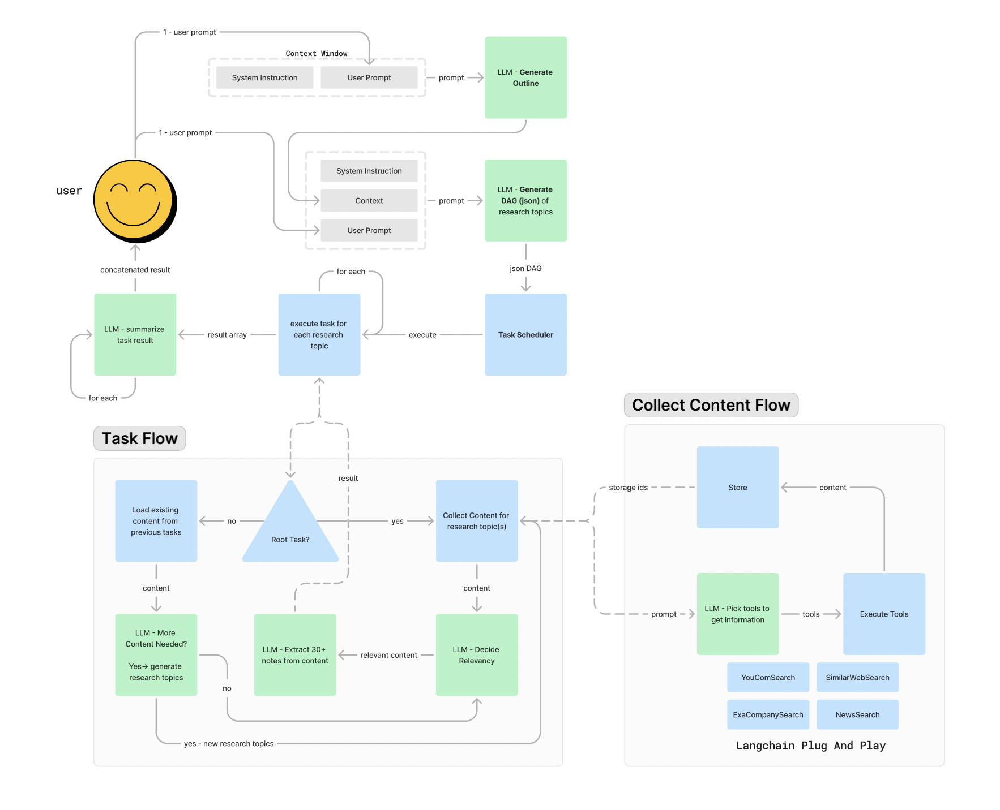

(yes, this README was written by AI 😛)

(Prompts and Eezo agents are comming soon)

# Research Agent

This repository contains the codebase for a Research Agent designed to generate research outlines, convert them into Directed Acyclic Graphs (DAGs), scrape the internet and interact with different APIs (Brave, You, Exa ...) to answer each question in the outline using various tools. This process is managed through a series of defined workflows that ensure efficient task execution and content collection.

Feel free to add your own tools to connect more datasources.

<div align="center">
  <a href="https://youtu.be/p_OGO7mT5_4">
    
  </a>
</div>

## Overview

The Research Agent automates the process of generating research content by leveraging LLMs to create a structured workflow. The workflow consists of generating an outline, converting it into a DAG, and using task scheduling to collect and summarize content. The diagram below illustrates the entire process flow.



## Workflow Description

### 1. User Interaction

- **User Prompt:** The user initiates the process by providing a prompt.
- **Context Window:** The user prompt and system instructions are fed into the LLM to generate an outline.

### 2. Outline Generation

- **LLM - Generate Outline:** The LLM creates a research outline based on the user prompt.
- **Generate DAG:** The outline is then converted into a JSON DAG by the LLM.

### 3. Task Scheduling

- **Task Scheduler:** The JSON DAG is processed by the task scheduler, which executes tasks in an optimized way (in parallel when possible, otherwise sequentially).

### 4. Task Flow

- **Execute Task:** Each task from the DAG is executed.
- **Result Handling:** Results are either collected from existing content or new content is gathered.
  - **Load Existing Content:** Checks if content from previous tasks can be used.
  - **Root Task Check:** Determines if the current task is a root task.
  - **Collect Content:** If new content is needed, it is collected, processed and added to the state and database.

### 5. Content Collection Flow

- **Pick Tools to Get Information:** The LLM selects the appropriate tools for information gathering.
- **Scrape and Store:** Tools are executed to scrape the internet, and the content is stored.
  - **Scrape:** Various tools like YouComSearch, SimilarWebSearch, ExaCompanySearch, and NewsSearch are used to gather content.
  - **Store:** The collected content is stored to be retrieved later by subsequent tasks or other research jobs.

### 6. Content Processing

- **Decide Relevancy:** The LLM evaluates the relevancy of the collected content.
- **Extract 30+ Notes:** Relevant content is processed to extract useful notes.
- **More Content Needed:** Checks if additional content is required. If yes, the process loops back to content collection.

### 7. Summarization

- **LLM - Summarize Task Result:** The final results are summarized and concatenated, providing the user with a comprehensive research output.

## Features

- **Automated Research Outline Generation:** Quickly create structured research outlines based on user prompts.
- **Directed Acyclic Graph (DAG) Conversion:** Efficiently organize tasks using DAGs for systematic execution.
- **Dynamic Content Collection:** Use multiple tools to gather relevant information from the internet.
- **Intelligent Task Scheduling:** Manage and execute tasks in a logical sequence.
- **Comprehensive Summarization:** Summarize collected content into concise, useful information.

## Getting Started

To get started with this research agent, follow these steps:

1. **Clone the repository:**

   ```bash
   git clone https://github.com/z33pX/research-agent.git
   ```

2. **Navigate to the project directory:**

   ```bash
   cd research-agent
   ```

3. **Set up a virtual environment:**

   ```bash
   python3 -m venv venv
   source venv/bin/activate   # On Windows use `venv\Scripts\activate`
   ```

4. **Install the required dependencies:**

   ```bash
   pip install -r requirements.txt
   ```

5. **Rename the `env` file to `.env` and fill in the necessary keys:**

   ```bash
   mv env .env
   # Open the .env file and add your keys
   ```

6. **Run the agent:**
   ```bash
   python app.py
   ```

## Contributing

We welcome contributions to enhance this project. Please fork the repository and create a pull request with your improvements.

## License

This project is licensed under the MIT License. See the [LICENSE](https://opensource.org/license/mit) file for details.

## Contact

For any questions or suggestions, please contact the project maintainer on [X (Twitter)](https://x.com/dan_schoenbohm).

---
