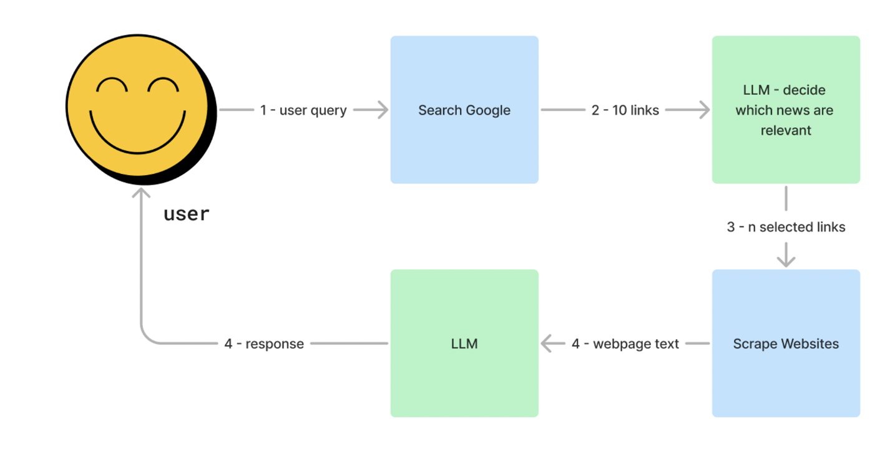
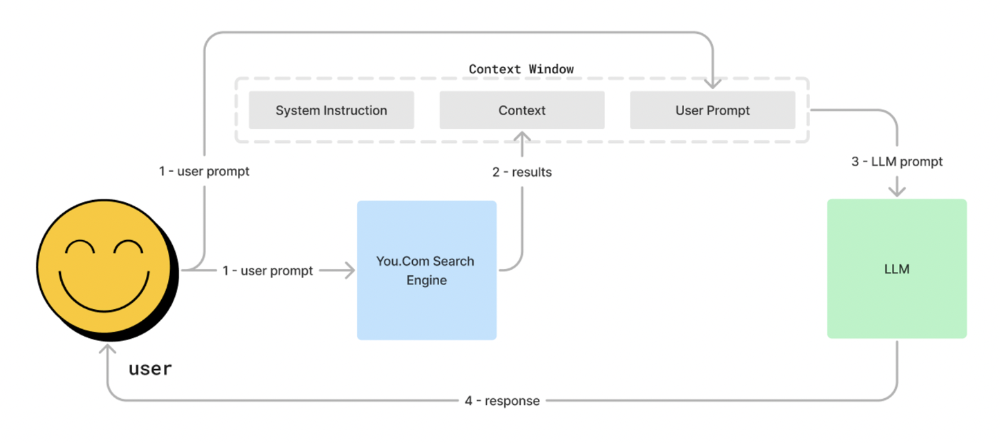
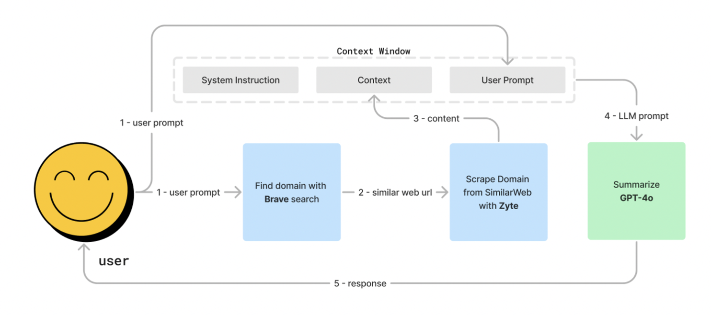
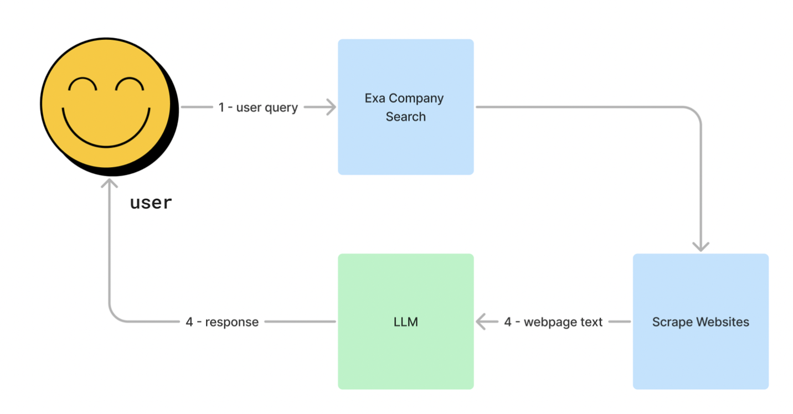

# Research Agent

The Research Agent is a powerful tool designed to automate the process of gathering and summarizing research information using a variety of APIs and web scraping tools.

It generates research outlines, converts them into Directed Acyclic Graphs (DAGs), scrapes webpages, and interacts with APIs (such as Brave, You, Exa, etc.) to answer each question in the outline. You can also add your own tools to connect additional data sources.

Consider this a draft. There is potential to improve both the repository and the agent itself. Contributions are welcome!

### Areas of Improvement

Flat vs. Depth: The research agent works well for topics that are widely covered on the internet, such as USA visa options and key metrics for SaaS companies. However, it is less effective for in-depth searches.

The planning step does not include any form of reflection or feedback from the user.

## Demo

[Langfuse Trace](https://cloud.langfuse.com/project/clvdpeujs0000hl9b7qqzw4n7/traces/ce95336f-418e-41df-8b4f-bf9cef10f364?observation=31f3979a-9c2f-4102-bc02-420744ea2f17&display=details)

<div align="center">
  <a href="https://youtu.be/JLB8A0O7C5g">
    
  </a>
  <p>Watch our demo to see the Research Agent in action, from generating research outlines to summarizing comprehensive responses.</p>
</div>

## Overview

This research agent workflow involves a user providing a prompt, which is processed by an LLM to generate an outline and a directed acyclic graph (DAG) of research topics (questions and their sub-questions). The task scheduler then executes tasks for each topic, collecting and storing content using various search tools (LangChain plug-and-play), evaluating its relevancy, and potentially generating additional research topics if more content is needed. After extracting cliff notes for each topic, the agent combines and summarizes them into one concise summary.


## Workflow Description

<div align="center">
  <a href="https://youtu.be/CoBMtCuA4MM">
    
  </a>
</div>

### 1. User Interaction

- **User Prompt:** The user initiates the process by providing a prompt.
- **Context Window:** The user prompt and system instructions are fed into the LLM to generate an outline.

### 2. Outline Generation

- **LLM - Generate Outline:** The LLM creates a research outline based on the user prompt.
- **Generate DAG:** The outline is then converted into a JSON DAG by another LLM.

### 3. Task Scheduling

- **Task Scheduler:** The JSON DAG is processed by the task scheduler, which executes tasks in an optimized way (in parallel when possible, otherwise sequentially).

### 4. Task Flow

- **Execute Task:** Each task from the DAG is executed.
- **Result Handling:** Results are either collected from existing content or new content is gathered.
  - **Load Existing Content:** Checks if content from previous tasks can be used.
  - **Collect Content:** If new content is needed, it is collected, processed and added to the state and database.

### 5. Content Collection Flow

- **Pick Tools to Get Information:** The LLM selects the appropriate tools for information gathering.
- **Scrape and Store:** Tools are executed to scrape webpages and retrieve data from APIs. Then, the content is stored.
  - **Scrape and retrieve:** Various tools like YouComSearch, SimilarWebSearch, ExaCompanySearch, and NewsSearch are used to gather content.
  - **Store:** The collected content is stored to be retrieved later by subsequent tasks or other research jobs.

### 6. Content Processing

- **Decide Relevancy:** The LLM evaluates the relevancy of the collected content.
- **Extract 30+ Notes:** Relevant content is processed to extract useful notes.
- **More Content Needed:** Checks if additional content is required. If yes, the process loops back to content collection.

### 7. Summarization

- **LLM - Summarize Task Result:** The final results are summarized and concatenated, providing the user with a comprehensive research output.

## Tools

### News Search

This tool searches for news on Google using the Serper API by first selecting relevant links with an LLM. It then scrapes the selected websites for content, which is processed by the LLM to generate a response.



### You.com Search

This tool searches for information using the You.com Search Engine by first selecting relevant results. It then processes these results using an LLM, which generates a response based on the user prompt and contextual information.



### Similar Web Search

This tool retrieves relevant data from SimilarWeb based on the user prompt. For example, if the prompt "Get web traffic for Tesla" does not include the relevant domain, the tool first searches for related domains using Brave Search. After finding the domain, it inserts it into a SimilarWeb URL, scrapes the page using Zyte, and provides the content to GPT-4o for summarization before delivering the final response to the user.



### Exa Company Search

This tool processes user queries by first using Exa Company Search to find relevant company information. It then scrapes the identified websites for content, which is subsequently processed by an LLM to generate a response for the user.



## Getting Started

To get started with this research agent, follow these steps:

1. **Clone the repository:**

   ```bash
   git clone https://github.com/z33pX/research-agent.git
   ```

2. **Navigate to the project directory:**

   ```bash
   cd research-agent
   ```

3. **Set up a virtual environment:**

   ```bash
   python3 -m venv venv
   source venv/bin/activate   # On Windows use `venv\Scriptsctivate`
   ```

4. **Install the required dependencies:**

   ```bash
   pip install -r requirements.txt
   ```

5. **Rename the `env` file to `.env` and fill in the necessary keys:**

   ```bash
   mv env .env
   # Open the .env file and add your keys
   ```

6. **Run the agent:**

   ```bash
   python app.py
   ```

## Contributing

We welcome contributions to enhance this project, whether it's adding new tools, fixing bugs, or improving documentation. Please fork the repository and create a pull request with your improvements.

## License

This project is licensed under the MIT License, allowing for free use, modification, and distribution. See the [LICENSE](https://opensource.org/license/mit) file for details.

## Contact

For any questions or suggestions, please contact the project maintainer on [X (Twitter)](https://x.com/dan_schoenbohm).
